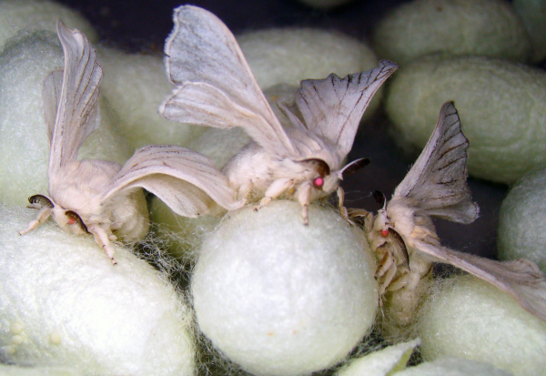

<!-- README.md is generated from README.Rmd. Please edit that file -->

# cocoon <a href="https://jeffreyrstevens.github.io/cocoon/"></a>

<!-- badges: start -->

[](https://www.repostatus.org/#active)
[](https://lifecycle.r-lib.org/articles/stages.html#stable)
[](https://app.codecov.io/gh/JeffreyRStevens/cocoon?branch=main)
[](https://github.com/JeffreyRStevens/cocoon/actions/workflows/R-CMD-check.yaml)
<!-- badges: end -->

The goal of `{cocoon}` is to provide functions that flexibly format
statistical output in a way that can be inserted into R Markdown or
Quarto documents. This is analogous to the
[`apa_print()`](https://frederikaust.com/papaja_man/reporting.html#statistical-models-and-tests)
functions in the [`{papaja}`](https://github.com/crsh/papaja) package,
but functions in `{cocoon}` can print Markdown or LaTeX syntax. If your
output document is a PDF, this doesn’t matter. But if your output
document is a Word document (as required by many journal publishers),
Markdown syntax generates editable output instead of an image of output.
The default style for statistical output follows [American Psychological
Association style](https://apastyle.apa.org/), but many defaults can be
over-ridden to flexibly format output.

## Installation

You can install the development version of `{cocoon}` from
[GitHub](https://github.com/) with:

``` r
# install.packages("remotes")
remotes::install_github("JeffreyRStevens/cocoon")
```

## Example

For an example, we’ll create a correlation from the `mtcars` data set.

``` r
library(cocoon)
(cars_corr <- cor.test(mtcars$mpg, mtcars$disp))
#> 
#>  Pearson's product-moment correlation
#> 
#> data:  mtcars$mpg and mtcars$disp
#> t = -8.7472, df = 30, p-value = 9.38e-10
#> alternative hypothesis: true correlation is not equal to 0
#> 95 percent confidence interval:
#>  -0.9233594 -0.7081376
#> sample estimates:
#>        cor 
#> -0.8475514
```

Now we can apply the `format_stats()` function to `cars_corr` to create
a Markdown-formatted character string for the statistical results. We
can embed this as inline R Markdown code to generate the results.

#### Code

`` Fuel efficiency and engine displacement were highly correlated (`r format_stats(cars_corr)`). ``

#### Output

Fuel efficiency and engine displacement were highly correlated (*r* =
-.85, 95% CI \[-0.92, -0.71\], *p* \< .001).

### Control formatting

We can also alter the output to allow other formatting. For instance, we
may not like APA’s silly rule to remove leading zeros before a value
that cannot exceed 1 (like correlations and p-values). And we may not
want to include the confidence limits around the correlation
coefficient. Finally, maybe we don’t want the statistics labels to be
italicized.

#### Code

`` Fuel efficiency and engine displacement were highly correlated (`r format_stats(cars_corr, pzero = TRUE, full = FALSE, italics = FALSE)`). ``

#### Output

Fuel efficiency and engine displacement were highly correlated (r =
-0.85, p \< 0.001).

## Functions and formatting types

- `format_stats()`: Statistical objects
  - Correlations (output from `cor.test()` and
    `correlation::correlation()`, including Pearson’s, Kendall’s, and
    Spearman’s correlations)
  - Student t-tests, Wilcoxon rank sum, and signed rank tests (output
    from `t.test()` and `wilcox.test()`, including one-sample,
    two-sample independent, and paired tests)
  - Bayes factors (output from
    [`{BayesFactor}`](https://cran.r-project.org/package=BayesFactor)
    package)
- `format_summary()`: Means and error (calculates from vector or uses
  vector of mean and error interval or mean, lower error limit, and
  upper error limit)
- `format_p()`: P-values
- `format_bf()`: Bayes factors (numerics)
- `format_scientific()`: Scientific notation
- `format_num()`: Other numbers
- `format_chr()`: Italicize character strings

## Related packages

- [`{papaja}`](https://github.com/crsh/papaja) - This package uses the
  `apa_print()` function to convert a number of R statistical objects
  into R Markdown output. However, it only outputs LaTeX syntax and only
  generates APA formatted output with minimal flexibility to alter the
  output.
- [`{apa}`](https://github.com/dgromer/apa) - This package also converts
  some R statistical objects to R Markdown output. While it allows other
  output format such as Markdown, it also only generates APA formatted
  output with minimal flexibility to alter the output.
- [`{insight}`](https://easystats.github.io/insight/) - This package
  extracts information from model objects. It includes `format_p()` and
  `format_bf()` functions that achieves similar goals as in this
  package, but they do not allow as much control over formatting of the
  labels or values.

## Citation

To cite `{cocoon}`, use:

> Stevens, Jeffrey R. (2024). cocoon: Extract, format, and print
> statistical output. (version 0.1.0)
> <https://github.com/JeffreyRStevens/cocoon>

## Contributing

[Contributions](https://jeffreyrstevens.github.io/cocoon/CONTRIBUTING.html)
to `{cocoon}` are most welcome! Feel free to check out [open
issues](https://github.com/JeffreyRStevens/cocoon/issues) for ideas. And
[pull requests](https://github.com/JeffreyRStevens/cocoon/pulls) are
encouraged, but you may want to [raise an
issue](https://github.com/JeffreyRStevens/cocoon/issues/new/choose) or
[contact the maintainer](mailto:jeffrey.r.stevens@protonmail.com) first.

Please note that the cocoon project is released with a [Contributor Code
of
Conduct](https://jeffreyrstevens.github.io/cocoon/CODE_OF_CONDUCT.html).
By contributing to this project, you agree to abide by its terms.

## Package name

The package name `{cocoon}` captures the main goal of transforming
statistical inputs into nicely formatted outputs. This mirrors cocoons,
which caterpillars build to transform into beautiful adult insects.
[Cocoons](https://en.wikipedia.org/wiki/Pupa) are formally defined as a
case that the larvae of moths spin around their pupa. So cocoons are
cases built by moths and some other insects, whereas butterflies produce
a chrysalis, which forms from their skin.



Photo source: Silk moths from [Wikimedia
Commons](https://commons.wikimedia.org/wiki/File:6_Monster_Silk_Moths.jpg)
